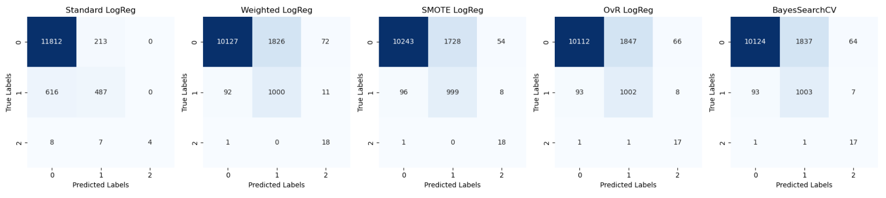

# Multinomial Logistic Regression with scikit-learn: Handling Imbalanced Datasets

## Project Overview

This project explores the application of **Multinomial Logistic Regression** for multiclass classification, focusing on techniques to handle **imbalanced datasets**. The primary objective is to evaluate the effectiveness of different methods—class weighting, SMOTE, One-vs-Rest (OvR), and Bayes Grid Search approaches—in handling a heavily imbalanced dataset with three target classes: *No Precipitation*, *Rain*, and *Snowfall*.

**Key Highlights**:
- Implementation of multinomial logistic regression models using scikit-learn
- Handling class imbalance with techniques like `class_weight`, SMOTE, and OvR
- Model evaluation using metrics appropriate for imbalanced data, primarily **balanced accuracy**
- Detailed learning curve analysis to assess model performance and generalization

## Data

The dataset consists of weather-related features and is derived from historical data, with the target variable being one of three classes: *No Precipitation*, *Rain*, or *Snowfall*. Data preparation includes feature engineering (such as creating lagged variables), handling missing values, and data transformations.

## Project Structure

The notebook is organized into the following sections:

1. **Introduction and Objective**:
   - Overview of multinomial logistic regression and the need for class imbalance handling.

2. **Data Preparation**:
   - Description of dataset and features
   - Feature engineering, including lagged variables for predictive modeling
   - Exploratory Data Analysis (EDA) covering class distribution, correlation analysis, and outlier detection

3. **Model Implementation**:
   - **Standard Logistic Regression**: Baseline model without imbalance handling
   - **Weighted Logistic Regression**: Application of `class_weight` to address imbalance
   - **SMOTE Logistic Regression**: Use of synthetic oversampling to balance classes
   - **One-vs-Rest (OvR) Logistic Regression**: Handling multiclass classification by training one binary classifier per class
   - **Bayes Grid Search Logistic Regression**: Hyperparameter tuning using Bayesian optimization

4. **Model Evaluation and Comparison**:
   - Performance metrics: Balanced accuracy, F1 score, and confusion matrix analysis
   - In-depth learning curve analysis for each model
   - Summary DataFrame with a side-by-side comparison of models

5. **Final Thoughts**:
   - Conclusion on the effectiveness of each model
   - Discussion of limitations due to computational constraints
   - Overview of future work, including potential exploration of advanced algorithms

## Key Findings
A consistent trade-off between precision and recall across all logistic regression iterations was observed and finaly
all failed to handle class imbalance in the dataset efficiently.
While class balancing techniques like SMOTE increased the model’s sensitivity to minority classes, they did so at the cost 
of introducing more misclassifications in the majority class.

This could be due to several factors:

    - Complex, potentially non-linear relationships among the predictors that Logistic Regression fails to capture.
    - Severe class imbalance, which continues to impact performance despite various balancing strategies.
    - The algorithm may have reached its full potential given the constraints of this dataset.

## Model Performance (Confusion Matrices)

Below the confusion matrices summarizing the performance of each model:

## Dependencies

- `scikit-learn`
- `pandas`
- `numpy`
- `matplotlib`
- `seaborn`
- `imblearn`
- `bayesian-optimization` (for BayesSearchCV)

## References

For more information on multinomial logistic regression and its implementation in scikit-learn, visit the [official scikit-learn documentation](https://scikit-learn.org/stable/).

## Future Work

Future exploration will include more advanced classification algorithms, such as Random Forests, Support Vector Machines (SVM), and Neural Networks, to further address class imbalance and improve predictive accuracy if possible.

## Author

This project was developed by Nikos Papakostas. Feedback and contributions are welcome!

---
